# My commodore 64 programs when I was a kid

These are programs I recovered from my old Commodore 64 disks. I wrote them
when I was around 10-12 years old. Earlier stuff has been lost, but considering it was on tape and my initial coding
it was probably not particulary interesting.

Some of this stuff is probably copied from books and personalised. Other was written together with a friend (hence the
A & B soft mark).

## Gestione C-64

Utility I wrote to manage disk and other features of the C64. I had multiple
versions of this application, and I kept adding more and more features or
modifying the graphics.

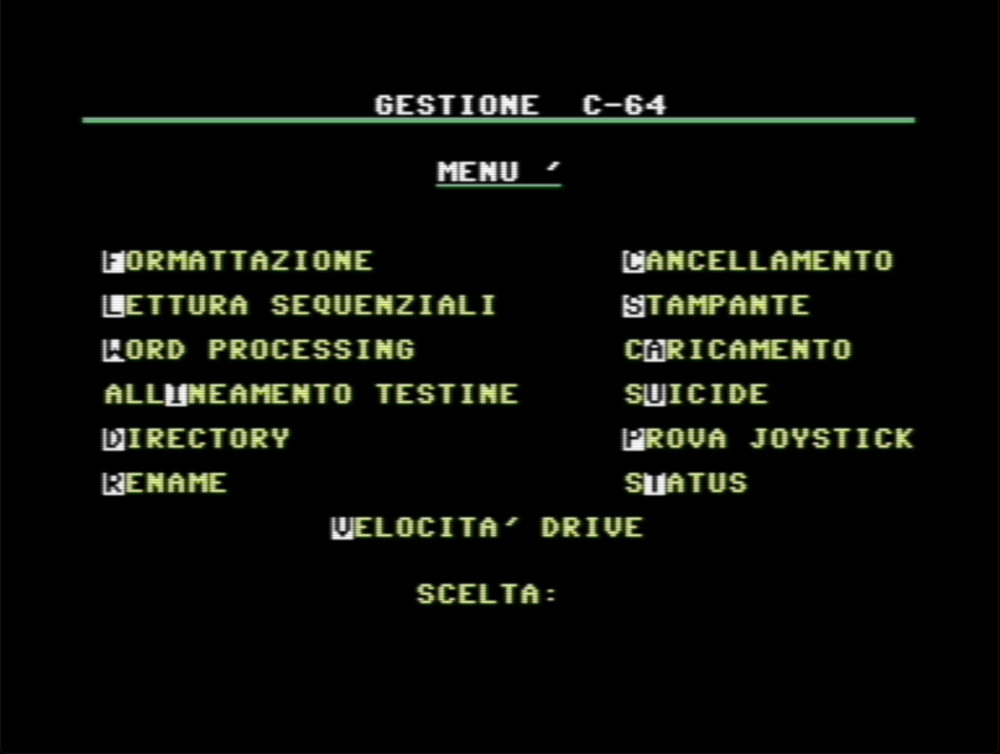

## imgread

Apparently an image reader from koalapaint data.

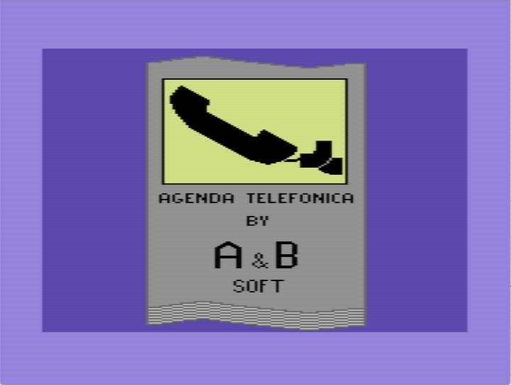

## Readdisk

Seems to be something that reads a disk block and shows its content in hex

## Archivio

Contact archive. Probably copied from somewhere.

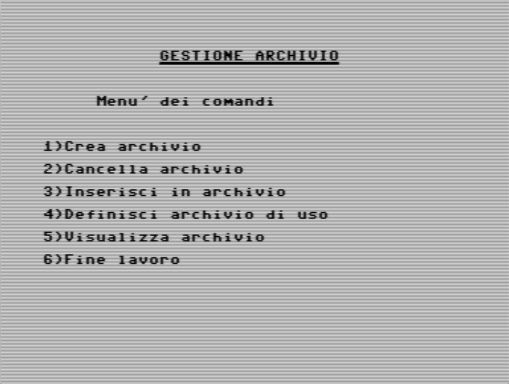

## Alta risoluzione

Some sort of spirograph drawing program. Probably copied from somewhere.

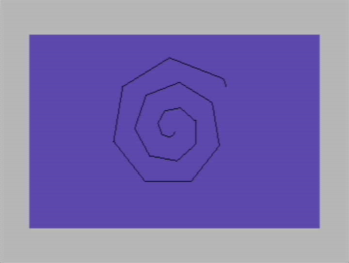

## Simulaz. dadi

Dice throwing simulator.

## Doodler

I have absolutely no clue

## ULPV (una lettera per volta)

Prints one letter at a time, slowly.

## Elicottero

A little toy program that flies a helicopter sprite. Interestingly had a code quick save feature at line 63998-63999.

# Mastermind

Play mastermind (guess the number)

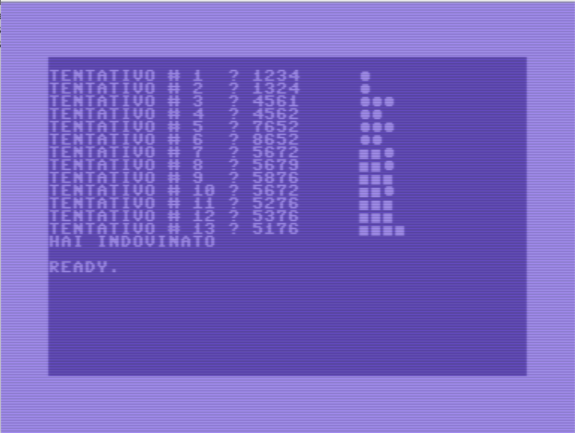

## Entrap

TRON-like game. Probably copied from somewhere.

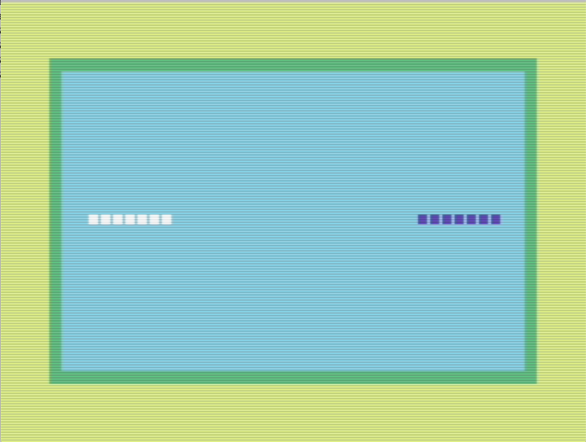

## Blob squasher

Like a snake game, minus the tail growth. Probably copied from somewhere.

## Sim movimento

Some kind of "road scrolling" simulation. It seems very slow, but it might be the emulator. I need to try it on the real hardware.

## Numeri romani

Converts numerical value to roman numeral

## mcd-mcm

Computes greatest common divisor and lowest common multiple of a pair of numbers

## Slot machine

simulates a slot machine. Probably copied from somewhere.

## Grafica

changes a letter to a different graphical glyph.

## Labirinto

Various versions of a labyrinth game.

## Conto

I have no idea.

## media

Computes the average of a set of values

## LED

Scrolling of text

## pass

A "password check"

## carica

Not sure. Seems to be loading something.

## oa

Alphabetically orders a set of names.

## header

Changes the header of a disk. Probably copied from somewhere as it's in English.

## porta

Apparently a reaction time test to assess if I was able to be an effective goalkeeper when I played soccer.

## ia (artificial intelligence)

Apparently a sort of toy to prank my friends in believing I had developed artificial intelligence. It 
asks how many letters has a word to guess, then proceeds to ask facts about the subject. Between every
facts, it asks to press a key, but since I would be the one at the keyboard, I would not simply play
a random key. Instead I would write the actual word letter by letter, then it would be printed out
at the end giving the illusion that it figured it out by itself.

## grafica-3d

Some sort of 3d plot. This is definitely something I copied from a book or programming magazine.
It's extremely slow and I am not sure which function is plotting.

## Dome Dweller

Some sort of space-themed resource management game that apparently I extended
from a starting base from a guy called tim hartnell. I found only a reference to [this book
called "games for your
atari"](https://archive.org/stream/ataribooks-games-for-your-atari/gamesforyouratari_djvu.txt)
where there's some text about dome dweller

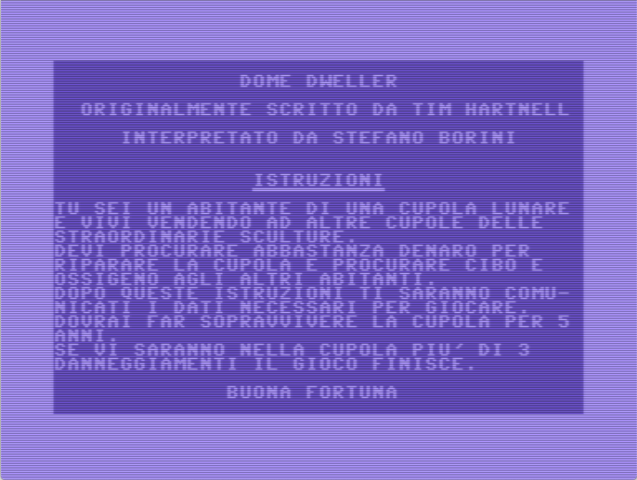
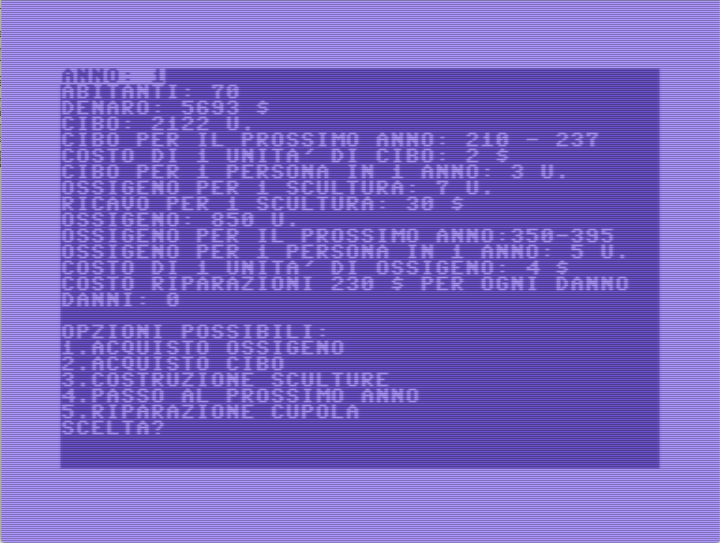

So my guess is that I read about dome dweller concept somewhere (not the above
book, I never heard of it) and wrote the game myself on that concept.

## A, AA

Initially, I had no idea what this code was doing. Looks like some kind of
integration, but I don't know what problem it's supposed to solve.  Then, I
found AA and I understood that it's some kind of calculator of the distance
between earth and mars throughout the mars year.  I have no idea why I
evaluated this, but I was into astronomy for a while and I had [this book from
Jean
Meeus](https://books.google.co.uk/books/about/Astronomia_con_il_computer.html?id=Ozm6PQAACAAJ&redir_esc=y)
which is probably where I found the equations.

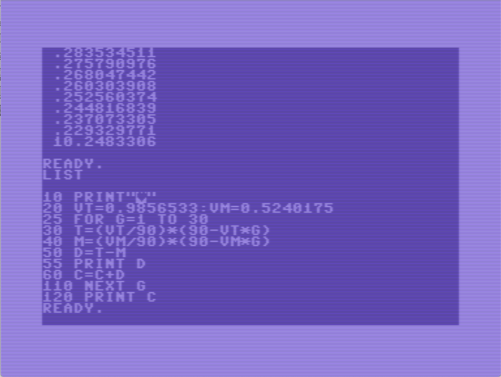
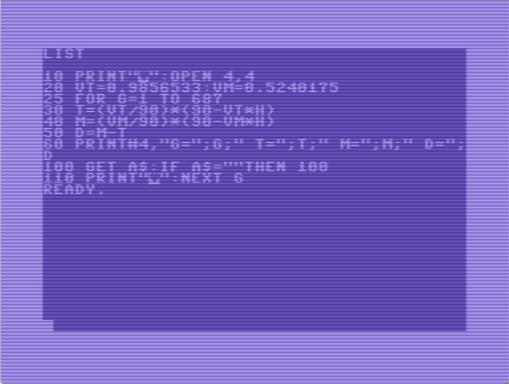

## graf2

No idea what this does. Apparently it resets the graphic mode and draws some kind of sinusoid at the very top.

## aggraf

Some kind of program that supposedly draws the top half of a flag that looks like the Windows 3.11 one.
I think I was trying to make my own logo for one of my programs so that looked like Windows 3.11.

## pigreco, pigreco-2

Obviously a computation of an approximation of pi using the ratio of random points falling inside and 
outside of a circle.

## evelina

I suspect this is an attempt to help a friend, by printing special accents in French by using 
control characters to the printer in order to move back of one space and put accents on letters.

## fff

Apparently a function plotter. I could not get it to work though.

## pp, fnz

From the comment, apparently it's a program I wrote to to compute the derivative of a function, 
but I could not get it to work.

I suspect that the vice emulator is not really working correctly for these programs.

## cc

The typical hello world program in basic. 

## life, lif1, lif2, lif3, liv1

Some kind of game of life attempt. Could not make them work. Probably I stopped halfway.

## Tris

Apparently, it's a program that plays tris against itself and shows statistics on who wins and who loses.

## totogol

No idea. Totogol is a chance game in Italy. I think I used this to estimate probabilities.

## Astronomy, astronomy-2

No idea. seems to be a started program about astronomic evaluations

## hanoi

A tower of hanoi game, but I could not get it to work.

# fract

Plots a mandelbrot fractal. This is apparently not working as intended, as this is the result I got, after a night of computation

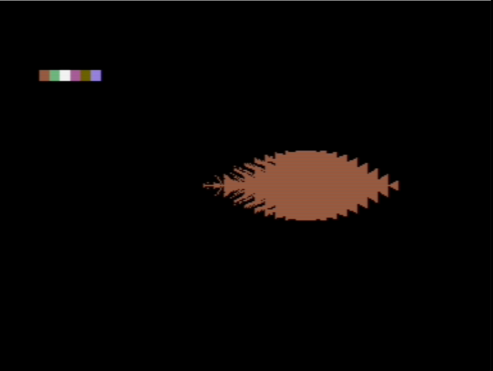

I need to fix it.

# mxprod

Matrix multiplication

# medie

Apparently something to evaluate the expected final school grade given the current average

# dos hex dumper

A memory dump program I wrote with a friend. Not sure why I called it "dos".

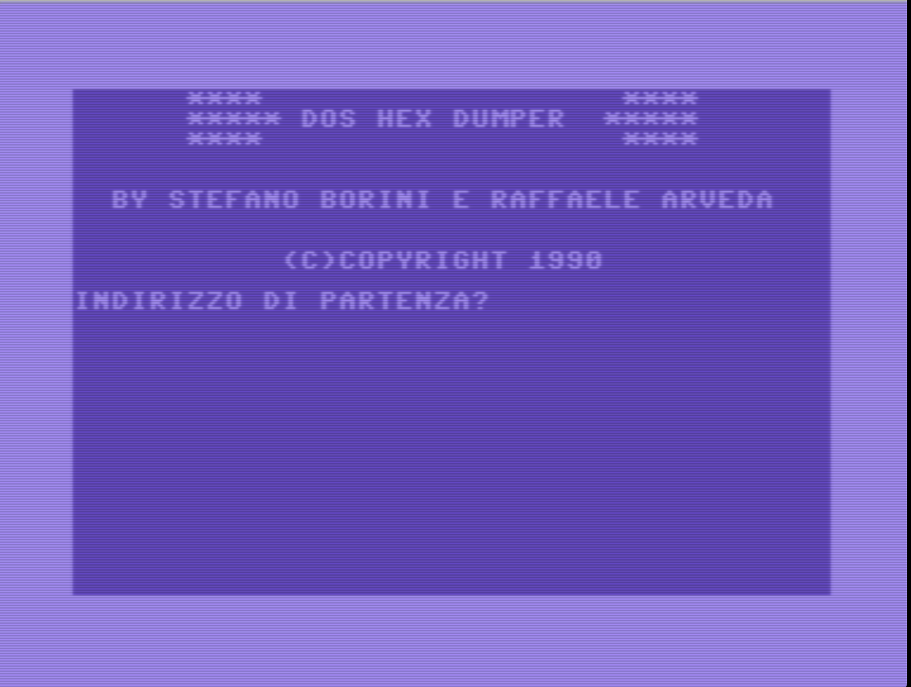
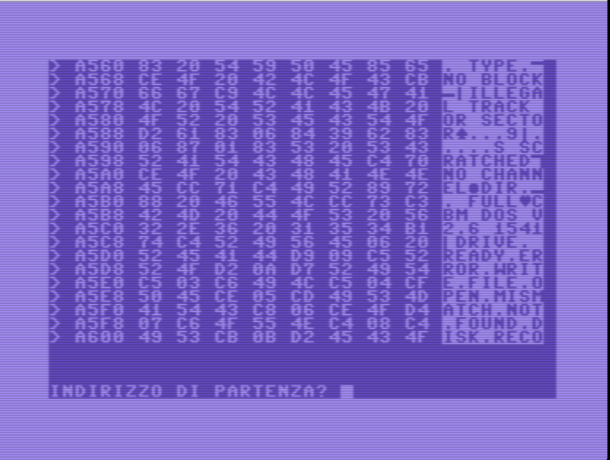

## Dumper - Dumper II

Disk dumper. 
This utility I wrote is able to read track and sector from disk and print out 
its content either as a hexadecimal dump or as a assembler dump, at the expected
memory address.

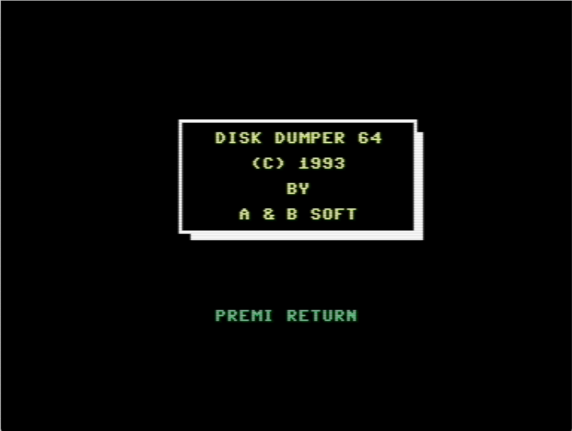
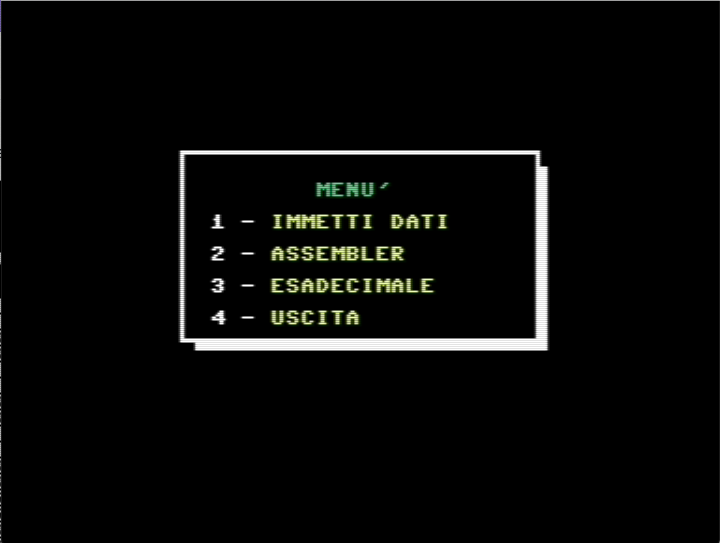
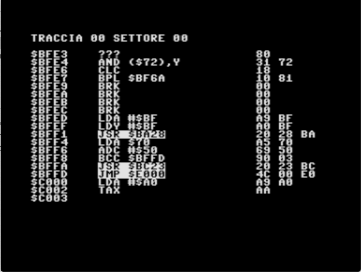
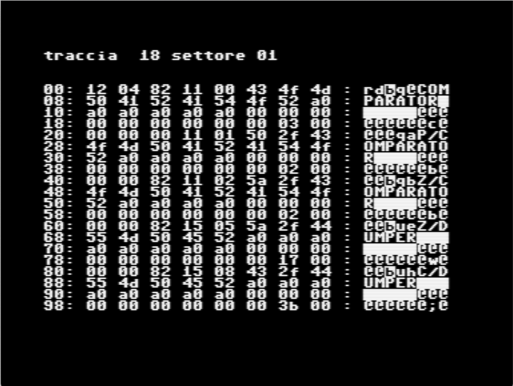

I have multiple versions of this program, scattered around my various disks.

## Previsioni

Some sort of "fake-ish" weather forecast program. 

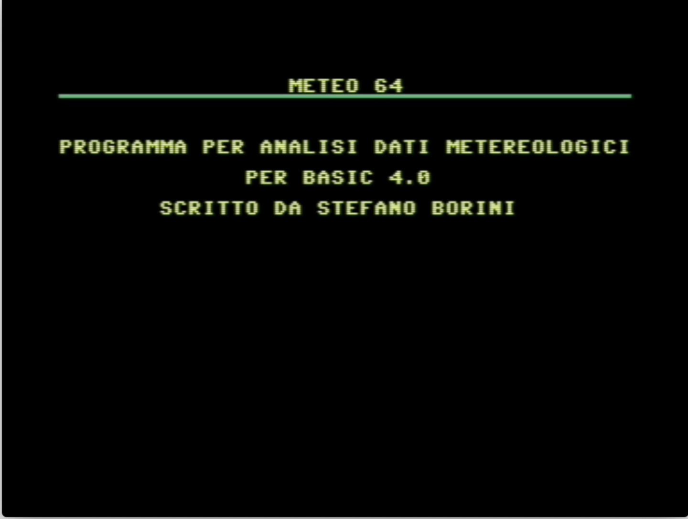

## ciccio

No idea

## comp

No idea

## p

No idea

## pr

No idea

## prega

No idea

## ps2

No idea

# p2

No idea

# prova

no idea
